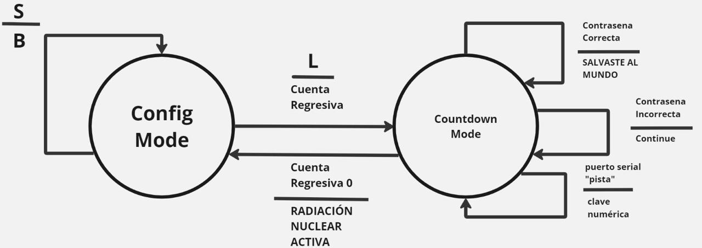

<h1 align="center">Raspberry Final</h1>

<p align="center">
  
</p>

## Descripción

Este proyecto consiste en una aplicación de cronómetro para Raspberry Pi Pico que permite al usuario modificar el tiempo preestablecido antes de iniciar la cuenta regresiva. Además, incluye una opción para ingresar una clave de rescate que detendrá la cuenta regresiva si es correcta.

## Diagrama



## Características

- **Modificación del tiempo preestablecido:** Permite aumentar o reducir el tiempo en 1 segundo mediante una tecla específica.
- **Activación de la cuenta regresiva:** Inicia la cuenta regresiva una vez establecido el tiempo preestablecido.

## Uso

1. Ejecute el programa.
2. Modifique el tiempo preestablecido según sea necesario.
3. Active el cronómetro.
4. Durante la cuenta regresiva, ingrese la clave de rescate si es necesario.

## Requisitos

- Entorno que admita la ejecución de aplicaciones de consola.
- Se recomienda tener un teclado para interactuar con el programa.

## Ejemplo de Código

```c++
// void configurarTiempoApertura() {
  Serial.println("CONFIG");
  while (!configurado) {
    if (Serial.available() > 0) {
      char input = Serial.read();
      if (input == 'S') {
        tiempoApertura++;
        if (tiempoApertura > 40) tiempoApertura = 40;
      } else if (input == 'B') {
        tiempoApertura--;
        if (tiempoApertura < 1) tiempoApertura = 1;
      } else if (input == 'L') {
        configurado = true;
        Serial.print("Tiempo configurado: ");
        Serial.println(tiempoApertura);
        estadoActual = CUENTA_REGRESIVA;
      }
    }
  }
}

```
- Esta función permite al usuario configurar el tiempo de apertura mediante la comunicación serial. Mientras el sistema no esté configurado (configurado es false), el programa espera la entrada del usuario. Si se presiona 'S', aumenta el tiempo de apertura; si se presiona 'B', disminuye el tiempo de apertura; si se presiona 'L', se confirma el tiempo configurado y se cambia el estado a CUENTA_REGRESIVA.

```c++
// void contarTiempo() {
  boolean conteoActivo = true; // Bandera para indicar si el conteo está activo
  for (int i = tiempoApertura - 1; i >= 0 && conteoActivo; i--) {
    Serial.print(i); // Imprime el número
    Serial.print(" "); // Agrega un espacio

    // Verifica si se ingresó la clave para detener el conteo
    if (Serial.available() > 0) {
      char input = Serial.read();
      if (input == 'C') {
        // Espera por los siguientes caracteres de la clave
        while (Serial.available() < 4) {}
        char clave[5]; // Almacena la clave ingresada
        for (int j = 0; j < 4; j++) {
          clave[j] = Serial.read();
        }
        clave[4] = '\0'; // Terminador de cadena
        if (strcmp(clave, "1234") == 0) {
          conteoActivo = false; // Desactiva el conteo si la clave es correcta
          Serial.println("Clave correcta. Deteniendo el conteo.");
          return; // Salir de la función contarTiempo() después de detener el conteo
        }
      }
    }

    delay(1000);
  }
  
  Serial.println(0); // Imprime el último segundo (0) sin salto de línea
  delay(1000); // Espera un segundo adicional antes de cambiar de estado
  Serial.println(); // Imprime un salto de línea para separar las salidas
  
  estadoActual = conteoActivo ? RADIACTIVO : CONFIGURACION; // Cambia el estado dependiendo si el conteo está activo o no
}
```
- En esta función, se realiza la cuenta regresiva desde el tiempo de apertura configurado hasta cero. Durante el conteo, se verifica si se ha ingresado una clave para detener el conteo. Si se ingresa la clave correcta ('1234'), se desactiva el conteo y se cambia el estado a CONFIGURACION. Si el conteo llega a cero sin detenerse, se cambia el estado a RADIACTIVO.

# Documentacion

- [Documento Guia](https://silk-motion-e7d.notion.site/Unidad-1-Software-para-sistemas-embebidos-86760026bfac4e339e649191eedab500)

# Implementos

Para realizar el programa se utilizo el programa de arduino, configurado para funcionar con el microcontrolador Raspberry pi pico y conectarlo al scriptcomunicator el cual es un monitor serial para ver lo que sucede en el programa una vez se empieza a ejecutar e interactuar con el mismo, siguiendo la guia que hay en el documento guia en notion previamente adjuntado.


